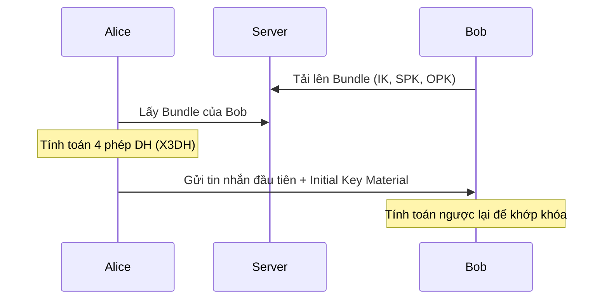

# Báo Cáo Đồ Án Môn Học: Mật Mã Học Cơ Sở

## 1. Tên Đề Tài
**Xây dựng Ứng dụng Trò chuyện Thời gian thực với Mã hóa Đầu cuối (End-to-End Encryption - E2EE) và Xác thực Sinh trắc học (FIDO2 Passkeys)**

---

## 2. Mục Tiêu Thực Hiện

### 2.1. Mục tiêu Học thuật
- Nghiên cứu và áp dụng mạnh mẽ các lý thuyết cũng như giao thức của Môn Mật mã học vào thực tiễn.
- Triển khai trao đổi khóa Diffie-Hellman, mã hoá đường cong elliptic Curve25519 (Ed25519).
- Nghiên cứu cơ chế vận hành của giao thức mã hóa tối tân nhất thế giới: **Signal Protocol**.
- Áp dụng các giải pháp đối phó với rủi ro bảo mật an toàn thông tin cơ bản: Chống tấn công trung gian (Man-In-The-Middle), Tấn công phát lại (Replay Attack), Tấn công lấy cắp tài khoản (Phishing).

### 2.2. Mục tiêu Kỹ thuật
- **Kiến trúc Zero-Knowledge:** Hoàn thiện một hệ thống nơi Máy chủ (Server) hoàn toàn mù thông tin nội dung; không có khả năng đọc, can thiệp hoặc giải mã tin nhắn.
- **Xóa bỏ Mật khẩu:** Rời bỏ phương thức lưu trữ mật khẩu dễ tổn thương, kết hợp xác thực WebAuthn/FIDO2 (Passkeys - Vân tay, nhận diện khuôn mặt).
- **Hệ thống Đa thiết bị/Nền tảng:** Phối hợp hệ sinh thái kỹ thuật đa ngôn ngữ: Backend Python FastAPI, Web Frontend React/Vite, và Desktop Python client sử dụng chung kiến trúc Socket theo thời gian thực.
- **Giải quyết Key Backup:** Cung cấp giải pháp sao lưu trạng thái phiên mã hóa và phục hồi đa dòng thiết bị mà không phá vỡ tính nguyên vẹn của Signal Protocol.

### 2.3. Mục tiêu Vận hành
- Đảm bảo nền tảng hỗ trợ mạng LAN bộ phận, công ty hoặc tổ chức.
- Cho phép nhắn tin an toàn không phụ thuộc đến kết nối hạ tầng viễn thông/internet bên thứ ba (Data Sovereignty).

---

## 3. Giải Quyết Vấn Đề (Thiết Kế & Triển Khai)

Dự án áp dụng nhiều giải pháp chuyên sâu cho các nút thắt trong quá trình xây dựng hệ thống:

### 3.1. Thiết lập Cấu trúc Zero-Knowledge Backend
- **Bài toán:** Backend không được trở thành điểm tối trong hệ thống (Tức là bị hack server đồng nghĩa với lộ dữ liệu tin nhắn).
- **Giải quyết:** Hệ thống Máy chủ trung tâm (phát triển bằng FastAPI, MongoDB, Socket.IO) chỉ phản hồi lưu lượng WebSockets và điều tiết phân phối các *Public Keys* (Identity Key, Signed PreKey, One-time PreKey). Mọi khóa riêng tư (*Private Keys*) được sinh ra và giữ nguyên vị trí trong lưu trữ phần cứng trên trình duyệt (IndexedDB) tại frontend Local mà không gửi cho ai. Server chỉ lưu giữ văn bản đã mã hóa (Ciphertext) hoặc bản sao lưu định dạng khóa bảo mật AES GCM siêu cứng cựa.

### 3.2. Triển khai Giao thức E2EE - Signal Protocol
- **Bài toán:** Yêu cầu một kỹ thuật đảm bảo Tính toàn vẹn, Bảo mật hoàn hảo về sau (Perfect Forward Secrecy - PFS) và Khả năng tự phục hồi (Post-Compromise Security - PCS).
- **Giải quyết:**
  - Tích hợp lớp mã hóa Signal dựa trên thư viện `libsignal-protocol-typescript`.
  - Khởi tạo quá trình trao đổi Key với `X3DH` (Extended Triple Diffie-Hellman) đảm bảo kết nối ban đầu giữa hai người lạ mà không lo lắng về MITM.
  - Vận hành thuật toán **Double Ratchet** để liên tục cập nhật và thay đổi cặp khóa ngẫu nhiên sau mỗi lần nhắn đi và nhận lại một tin nhắn. Nhờ vậy, ngay cả khi một khóa phiên vô tình bị rò rỉ, mọi tin nhắn của quá khứ hay tương lai đều không thể được giải mã.

### 3.3. Xác Thực Không Mật Khẩu với FIDO2 / Passkeys
- **Bài toán:** Phishing và Bruteforce là phương thức xâm phạm nhiều nhất hiện nay, người dùng tạo mật khẩu thường quá đơn giản hoặc tái sử dụng.
- **Giải quyết:** Thay cho Mật Khẩu, thiết bị tự động tạo một cặp Public-Private key trong phần cứng bảo mật sinh trắc học khi người dùng đăng ký. Tại các lần truy cập, máy chủ gửi *Challenge* (Thử thách) dạng chuỗi Byte ngẫu nhiên, phần cứng sử dụng Private Key ở máy tính (Windows Hello, TouchID) ký lên và chuyển lại, hoàn toàn chặn đứng mọi nỗ lực Phishing vì nó bị trói chặt vào địa chỉ URL thực sự của phiên và không thể đọc trộm.

### 3.4. Quản Lý Tính Toàn Vẹn Khóa (Key Backup & Restore)
- **Bài toán:** Điểm yếu lớn của Signal Protocol cấu hình cục bộ truyền thống là hiện tượng mất khóa do người sử dụng mua máy mới hoặc xóa lịch sử tải lại trình duyệt, dẫn đến tin nhắn bị mã hóa thành chuỗi lỗi (Decryption Error).
- **Giải quyết:** Cung cấp tiến trình mã hóa bất đối xứng các tập sessions/keys của chính Signal đang tồn tại tại máy đang dùng, khóa chúng lại bằng một *Recovery PIN* bảo mật. Tập khóa (Encrypted Bundle) này được lưu tạm trên đám mây dưới dạng ciphertext, cho phép người dùng đổi máy tiến hành nhập PIN để khôi phục mọi Identity/Sessions cũ, giữ vững ratcheting giao tiếp với bạn bè một cách liền mạch.

---

## 4. So Sánh Với Thị Trường

Dự án cung cấp một kết quả đối sánh đáng chú ý khi chắp nối các ứng dụng phổ biến trên thị trường:

### 4.1. So với Các Nền Tảng Phổ thông (Messenger, Zalo, Skype)
- **Bảo mật và Quyền Tối thượng Data (Data Sovereignty):**
  - Đa số ứng dụng truyền thông lưu văn bản thô (Plaintext) hoặc giữ khóa mã hóa máy chủ tập trung của nhà mạng phát hành. Điều này đồng nghĩa với việc Quản trị viên, cơ quan chính sách mạng hoặc Hacker chiếm quyền hạ tầng có thể thoải mái đọc dữ liệu của mọi người dùng.
  - Hệ thống cục bộ của đồ án sử dụng phương thức **E2EE**, cho dù bạn là siêu quản trị viên kiểm soát Backend và Database, bạn cũng chỉ thấy được các chuỗi ngẫu nhiên không có ý nghĩa toán học. Dữ liệu chỉ nằm trong tay hai người đang chat với nhau.

### 4.2. So với Các Ứng Dụng Chuyên Mã Hóa (Signal, WhatsApp, Telegram Secret Chat)
- **Danh tính Cục bộ vs Viễn thông:** 
  - *WhatsApp/Signal* vẫn sử dụng Số Điện Thoại làm khóa định danh gốc để đăng ký. Điều kiện này buộc người dùng cung cấp thông tin đời tư và cần cơ sở hạ tầng viễn thông/Internet nhà điều hành cho SMS xác nhận.
  - *Sản phẩm Đồ Án*: Không dùng số điện thoại. Mỗi tài khoản được định danh ẩn danh thông qua FIDO2 Passkeys. Hệ thống rất lý tưởng cho môi trường *chỉ* hoạt động trên mạng nội bộ (LAN) tại công ty đóng kín mà không cần kết nối mạng toàn cầu.  

- **Hỗ trợ Khôi phục Phân tán (Sự linh hoạt đa Web):**
  - *Telegram Secret Chats* hạn chế khắt khe tính năng E2EE 1-1 trên duy nhất một thiết bị tạo khởi nguồn, cắm khôi phục trên web/desktop khác.
  - *WhatsApp* phải đồng bộ thiết bị qua QR-code và điện thoại chạy nền.
  - *Sản phẩm Đồ Án*: Phân tán bảo mật tốt hơn theo cấp độ Client-Side Sync, cho phép tải lại phiên thông qua Backup mã hóa tại mọi Web Browser chỉ cần có mã PIN khôi phục.

### 4.3. Giá Trị Nổi Bật Đặc Thù của Sản Phẩm (USP)
1. **Passkeys First Authentication:** Một trong số rất ít hệ thống nội bộ E2EE sử dụng tích hợp xác thực không mật khẩu bằng tiêu chuẩn Passkeys FIDO2 cấp tiến làm nền chuẩn bảo mật ở tuyến đầu.
2. **Air-Gapped & Enterprise Ready:** Sẵn sàng cho việc phân phối "Đóng hộp tư nhân", phù hợp xây dựng máy chủ liên lạc bảo mật hoàn toàn offline dành cho các trụ sở, ngân hàng, công ty tư vấn yêu cầu chuẩn bảo vệ dữ liệu cực kỳ khắt khe lưu trữ cục bộ thay vì gửi thông tin lên đám mây của bên thứ ba.

---

## 5. Minh Chứng Kỹ Thuật (System Proofs)

Để đảm bảo các cam kết về bảo mật, hệ thống cung cấp các minh chứng kỹ thuật thông qua sơ đồ vận hành và dữ liệu thực tế tại Client.

### 5.1. Quy trình thiết lập phiên X3DH
Cơ chế X3DH cho phép Alice và Bob tạo khóa chung bí mật ngay cả khi Bob đang ngoại tuyến.

> **[Ảnh minh họa 1: Mã nguồn khởi tạo Identity Key và PreKeys tại `signalHelper.js`]**

### 5.2. Cơ chế Double Ratchet (Tự phục hồi)
Sau khi thiết lập xong, mỗi tin nhắn gửi đi sẽ làm "xoay" (ratchet) các khóa, đảm bảo nếu một khóa bị lộ, các khóa sau sẽ tự động được làm mới và không thể bị giải mã ngược lại quá khứ (PFS).

> **[Ảnh minh họa 2: Console Log hiển thị `Encrypt success. Type: 3` (X3DH) và `Type: 1` (Ratchet)]**

### 5.3. Lưu trữ khóa an toàn tại Local
Mọi khóa riêng tư đều được lưu trữ trong IndexedDB của trình duyệt, không bao giờ rời khỏi thiết bị người dùng.

> **[Ảnh minh họa 3: Trình quản lý IndexedDB hiển thị bảng `keys` và `sessions` của Signal]**

### 5.4. Tính Bí mật và Toàn vẹn dữ liệu
Tin nhắn lưu tại Database máy chủ hoàn toàn là bản mã (Ciphertext).

> **[Ảnh minh họa 4: Dữ liệu tin nhắn đã mã hóa (Base64) trong MongoDB]**
