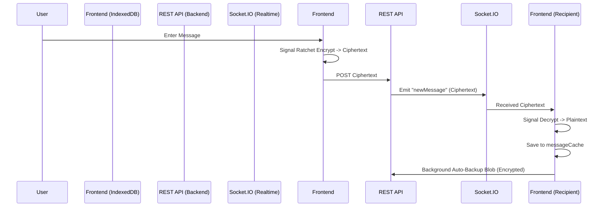

# Phân tích Flow Hoạt động của Ứng dụng Chat E2EE (Chatify)

Dưới đây là sơ đồ và phân tích chi tiết về luồng dữ liệu (Data Flow) cốt lõi của ứng dụng Chat E2EE mà chúng ta đang phát triển. Ứng dụng kết hợp cơ chế mã hóa đầu cuối (Signal Protocol) với kỹ thuật Auto-Backup.

---

## 1. Luồng Xác thực và Khởi tạo Hệ thống (Authentication & Init Flow)

Luồng này bắt đầu ngay khi người dùng mở ứng dụng hoặc tải lại trang:

1. **Khôi phục phiên đăng nhập (`checkAuth`)**:
   - Frontend (Zustand `useAuthStore`) gọi API `/auth/check`. Nếu người dùng đã đăng nhập (có cookie hợp lệ), backend (Python FastAPI) trả về thông tin user.
   - Frontend kết nối ngay kênh thời gian thực thông qua Socket.IO.
   
2. **Kiểm tra Danh tính Mã hóa (`checkLocalIdentity`)**:
   - Ứng dụng kiểm tra IndexedDB của trình duyệt (`keys` store).
   - **Trường hợp 1 (Có Local Keys)**: 
     - Trích xuất Public Keys (PreKey, SignedPreKey, IdentityKey). 
     - **Tự động bổ sung (Auto-Replenish)**: Hệ thống kiểm tra `OneTimePreKey`. Việc tiêu thụ khóa này là một phần của giao thức Signal để đảm bảo Forward Secrecy. Nếu khóa đã bị sử dụng và biến mất khỏi IndexedDB, ứng dụng tự động sinh một `OneTimePreKey` mới tinh.
     - Sau đó, tự động đồng bộ (upload) toàn bộ Public Bundle lên Server để đảm bảo người khác luôn có khóa để nhắn tin khởi tạo phiên.
   - **Trường hợp 2 (Mất/Không có Local Keys)**:
     - Gọi lên Server kiểm tra xem có bản sao lưu khóa (`Backup Blob`) nào không.
     - **Nếu Có Backup**: Bật `PassphraseModal` ở chế độ *Khôi phục*. Người dùng nhập Passphrase -> Giải mã Blob -> Nạp lại Keys, Sessions và MessageCache vào IndexedDB.
     - **Nếu Không Có Backup**: Lần đăng nhập đầu tiên -> Frontend gọi Signal Protocol tự động sinh cặp khóa mới -> Tải Public Keys lên Server -> Bật `PassphraseModal` yêu cầu thiết lập Passphrase.

---

## 2. Luồng Gửi Tin Nhắn (Sending Message Flow)

Khi User A gửi tin nhắn cho User B:

1. **Optimistic UI**: 
   - Tin nhắn hiển thị ngay trên màn hình ở dạng `temp_id` để tăng tốc độ phản hồi.
2. **Tra cứu Khóa (Fetch Public Bundle)**:
   - Client A gọi API lấy Public Bundle của User B từ Server.
3. **Mã hóa Cục bộ (Local Encryption)**:
   - `encryptWithSignal()` chạy dưới lớp Web Workers/WebAssembly.
   - Nếu A chưa chat với B bao giờ, tạo Session mới bằng One-Time PreKey của B.
   - Nội dung thô (Plaintext) bị mã hóa thành `ciphertext` (Base64) thông qua luồng AES-CTR và chuỗi Ratchet Key.
4. **Gửi Lên Server**:
   - Gửi payload: `{ ciphertext, messageType, sessionId }` qua API REST (`POST /messages/send/{recipientId}`).
   - *Lưu ý: Server không có cách nào biết nội dung tin nhắn là gì*.
5. **Cập nhật Cache Cục bộ**:
   - A không thể tự giải mã ciphertext của chính bản thân (do tính chất asymmetric của Signal). Vì vậy, ngay sau khi gửi thành công, Plaintext được lưu vào IndexedDB `messageCache` của A.
   - Gọi hàm **Auto-Backup** để tự động đóng gói sự thay đổi này tải lên Cloud.

---

## 3. Luồng Nhận Tin Nhắn (Receiving Message Flow)

Khi Server thông báo có tin nhắn mới cho User B thông qua Socket.IO:

1. **Lắng nghe sự kiện**:
   - `socket.on("newMessage")` nhận `ciphertext` từ Server.
2. **Giải mã (Decryption)**:
   - `decryptWithSignal()` khởi tạo Session Cipher.
   - Áp dụng các khóa hiện tại trong IndexedDB để dịch `ciphertext` ra Plaintext. Nếu MAC không khớp (do lỗi session out-of-sync), catch error và chuyển thành UI "🔒 [Tin nhắn từ phiên cũ - không thể giải mã]".
3. **Cache & Push Auto-Backup**:
   - Giống như bên gửi, Plaintext giải mã xong được ném vào `messageCache`.
   - Hàm **Auto-Backup** được kích hoạt để đẩy bản Local DB mới nhất lên Server, đảm bảo backup bị không lỗi thời.
4. **Hiển thị & Thông báo**:
   - Render text rõ ràng ra màn hình Chat và phát âm báo.

---

## 4. Luồng Lấy Lịch Sử Phân Trang (Fetch History Flow)

Khi User mở một màn hình Chat cũ:

1. Frontend tải list Ciphertexts gốc từ API backend (`GET /messages/{userId}`).
2. **Duyệt qua từng tin nhắn (Sequentially)**:
   - Ứng dụng lookup trong `IndexedDB.messageCache` trước (Do chi phí tra cứu thấp và không làm sai lệch Ratchet Key).
   - Nếu rỗng (chưa cache): Chạy qua Signal Decryption. Giải mã thành công thì viết liền lại vào `messageCache` và gọi Push Auto-Backup.
   - Nếu là tin nhắn từ chính mình (`senderId === authUser._id`): Bắt buộc phải đọc từ Cache. Nếu Cache không có (vô tình mất hoặc backup quá cũ), sẽ hiển thị "[Bạn đã gửi tin nhắn mã hóa]".

---

## 5. Cơ chế Cloud Backup Ngầm (Transparent E2EE Backup)

Vì Signal khóa phiên mã hóa trên một thiết bị (Local device), nếu người dùng đổi máy tính hoặc clear trình duyệt, họ sẽ mất toàn bộ Keys và History. Đây là cách hệ thống khắc phục điều này không cần User thao tác tay:

1. **Cấu trúc Blob Backup**:
   - Object gốc: `{ keys: {...}, sessions: {...}, messageCache: {...} }`
   - Bọc và mã hóa luồng bằng **PBKDF2-SHA256 (100k iteration) -> AES-256-GCM**.
   - Input đầu vào: Passphrase của người dùng lúc đăng nhập.
2. **Khóa Ảo (Tránh hỏi Passphrase liên tục)**:
   - Khi nhập Passphrase đúng, Plaintext Passphrase sẽ tự động được lưu vào IndexedDB tại `auto_backup_passphrase`.
   - Mỗi lần ứng dụng thay đổi mã hóa (Gửi, Nhận, Sinh khóa mới), `autoBackupKeys()` sẽ tự động gọi dưới background, nén file và upload blob lên server mà **không làm phiền người dùng**.
3. **Hiệu ứng Khôi phục liền mạch**:
   - Mật khẩu tạo 1 lần. Cloud blob update liên tục lúc runtime (sử dụng model giống Cloud Backup của WhatsApp). Khi qua thiết bị mới (hoặc ấn Reload), Local Key bị trống, popup Passphrase kích hoạt, tải lại file Blob mới nhất đảm bảo tỷ lệ đọc lịch sử là 100%.

---

### Sơ đồ luồng tương tác tổng quát:

